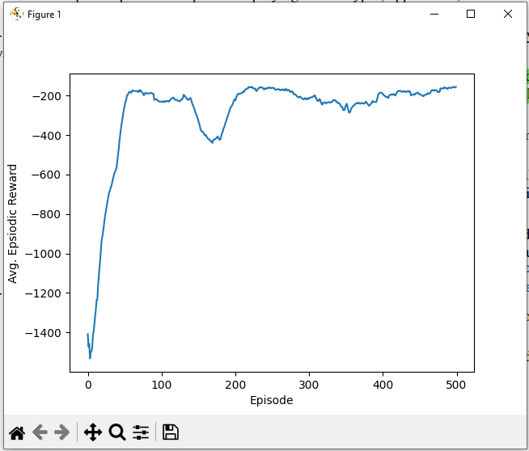
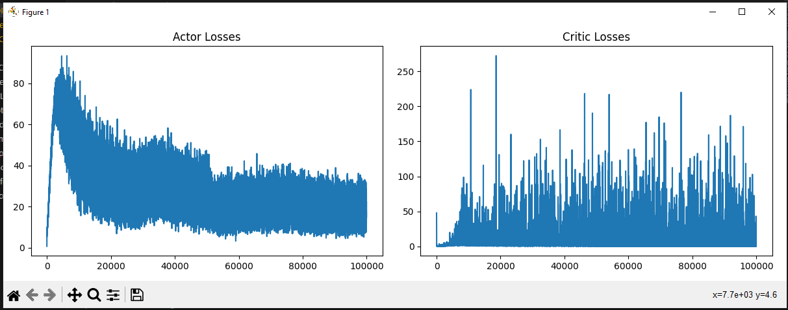

# Robotic Arm Joint Control using Deep Reinforcement Learning

## Introduction

This project demonstrates the use of deep reinforcement learning (DRL) algorithms to control a single joint of a robotic arm in simulation. The goal is to develop and verify AI-based control strategies that can later be extended to real-world robotic systems. By focusing on one degree of freedom (DoF), this work serves as a proof of concept for applying machine learning to robotic control tasks.

## Task Description

The primary objective is to implement an AI system capable of controlling a robotic arm's joint. As a first step, the project simulates a single joint (one DoF) to validate the effectiveness of the chosen machine learning algorithms. The simulation environment used is OpenAI Gym's `Pendulum-v1`, which closely resembles the dynamics of a robotic arm joint. The agent's task is to apply appropriate torque to keep the pendulum (joint) upright, mimicking the control challenge in robotic arms.

## Project Structure

- `DRL.py`: Implements a Deep Q-Network (DQN) approach for continuous control.
- `DDPG.py`: Implements a Deep Deterministic Policy Gradient (DDPG) approach for continuous control.

## Approaches

### 1. Deep Q-Network (DQN) Approach

**File:** `DRL.py`

#### Overview

DQN is a value-based reinforcement learning algorithm that uses a neural network to approximate the Q-value function. In this project, the DQN agent interacts with the `Pendulum-v1` environment, learning to apply the correct torque to balance the pendulum.

#### Key Components

- **QNetwork:** A neural network that predicts Q-values for given states.
- **ReplayBuffer:** Stores past experiences for experience replay, improving learning stability.
- **DQNAgent:** Manages action selection, learning, and experience storage.
- **Training Loop:** The agent interacts with the environment, learns from experiences, and updates its policy.
- **Evaluation:** After training, the agent is tested without exploration to assess its performance.

#### Workflow

1. Initialize the environment and agent.
2. For each episode:
   - Reset the environment.
   - Select actions using an epsilon-greedy policy.
   - Store experiences in the replay buffer.
   - Sample random batches from the buffer to train the Q-network.
   - Decay the exploration rate (epsilon).
3. Plot training progress and evaluate the agent's performance.

---

### 2. Deep Deterministic Policy Gradient (DDPG) Approach

**File:** `DDPG.py`

#### Overview

DDPG is an actor-critic, model-free algorithm designed for environments with continuous action spaces. It uses two neural networks: an actor (for selecting actions) and a critic (for evaluating actions). DDPG is well-suited for robotic control tasks.

#### Key Components

- **Actor:** Neural network that outputs continuous actions given the current state.
- **Critic:** Neural network that estimates the Q-value for state-action pairs.
- **OUActionNoise:** Adds temporally correlated noise for exploration in continuous spaces.
- **Buffer:** Stores and samples experiences for training both actor and critic networks.
- **Training Loop:** The agent interacts with the environment, updates networks, and soft-updates target networks.
- **Evaluation:** The trained agent is tested without exploration noise.

#### Workflow

1. Initialize the environment, actor, critic, and replay buffer.
2. For each episode:
   - Reset the environment.
   - Select actions using the actor network with added noise.
   - Store experiences in the buffer.
   - Sample batches to update the actor and critic networks.
   - Soft-update target networks for stability.
3. Plot training progress and evaluate the agent's performance.

---

## Installation

1. **Clone the repository:**
   ```sh
   git clone https://github.com/Yousif-AlEshari/Robotic-Arm-Joint-Control_DRL.git
   cd robotic-arm-drl
   ```

2. **Install dependencies:**
   Make sure you have Python 3.8+ installed. Then, install the required packages:
   ```sh
   pip install torch gymnasium numpy matplotlib
   ```

   *Note: If you use a different Gym version, you may need to adjust the import statements.*

---

## How to Run

### DQN Approach

```sh
python "DRL.py"
```

### DDPG Approach

```sh
python "DDPG.py"
```

Both scripts will train the agent, plot training progress, and evaluate the agent's performance on the `Pendulum-v1` environment.

---

## Results Visualization

During training, both the DQN and DDPG approaches generate plots to visualize the agent’s learning progress. These graphs show the increase in average rewards and the decrease in loss values over episodes, demonstrating the effectiveness of the AI system in learning to control the joint.

Below are sample output graphs produced by the code:

### Training Results


*Average rewards per episode Graph.*


*Actor and critic loss values per episode .*

> **Note:** These graphs are generated automatically when you run the training scripts. They provide a clear indication of the agent’s performance improvement over time.

## Author

**Yousif Al-Eshari**